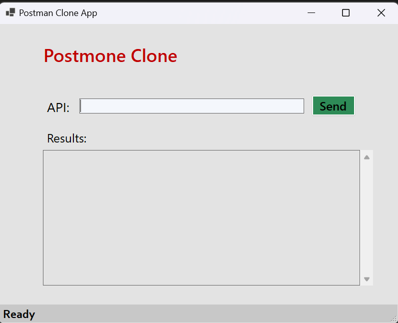
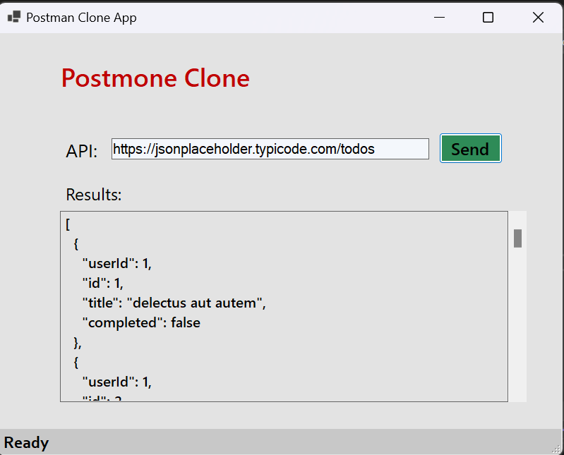

# PostmanCloneApp
Postman clone App provides user friendly interface to make GET request and get results in JSON format.
Ideal for Developers, begginers and testers, simplifies API interaction and debugging.

## Technologies used:
* C#
* .net8
* winforms
* HttpClient

## Using the App

1.Download the executable file from release section.

2.whenever app launches, it should look like these 
.

3.Put your API and hit the 'send'.
.

4.Hire me.

## Upcoming Changes
* Adding POST,PUT,DELETE,PATCH functionality.
* Handling API Authentication.
* Adding API headers.
* Provide web based support to app.
